# VeyForge: AI 3D Assets and Sim-to-Real Infrastructure

<div align="center">

**From physical objects to simulation, and from simulation back to the real world.**

[Try VeyForge](https://veyforge.tsingtaoai.com/) | [TsingtaoAI](https://github.com/TsingtaoAI)

<br />

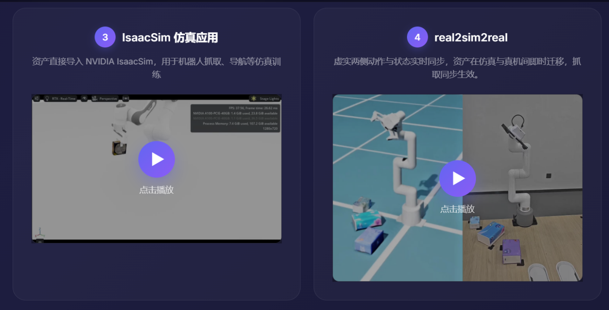

</div>

VeyForge is an AI-driven 3D asset factory for embodied intelligence, robotics simulation, digital twins, and robot training. It turns photos, images, or text prompts into usable 3D assets, adds simulation-oriented physical properties, and connects those assets to Isaac Sim, Isaac Lab, ROS 2, and real robot validation.

The goal is not only to generate a model that looks right. The goal is to produce an asset that a robot can perceive, collide with, grasp, move, test, and improve through a repeatable data loop.

## At a Glance

| Capability | VeyForge |
| --- | --- |
| Multi-view input | Reconstruct an object from 2 to 4 photos |
| Other inputs | Single-image-to-3D and text-to-3D |
| Typical generation time | About 30 seconds per asset, depending on input and settings |
| Visual outputs | GLB mesh, PLY Gaussian point cloud |
| Simulation outputs | USD / USDA physical assets and URDF-oriented workflows |
| Preview modes | Interactive 3D, Gaussian rendering, and normal rendering |
| Physics support | Mass, density, center of mass, inertia, collision bodies, friction, and restitution |
| Simulation integration | NVIDIA Isaac Sim and web-based IsaacSim-qt workflows |
| Training integration | Isaac Lab and IsaacLab-Arena style Scene / Embodiment / Task composition |
| Real robot integration | ROS 2 joint-state synchronization and Sim-to-Real validation |
| Deployment options | Cloud service, enterprise integration, and private deployment scenarios |

## Why VeyForge?

Robots need more than a collection of attractive meshes. A useful robot asset must carry enough visual, geometric, semantic, and physical information to participate in a task.

Traditional asset production often requires separate steps for:

- Photography and reference collection
- 3D modeling and texturing
- Mesh cleanup and optimization
- Collision-body construction
- Mass, friction, and inertia configuration
- USD or URDF adaptation
- Simulator loading and task-specific repair
- Real robot validation

VeyForge brings these steps into one production-oriented workflow. It makes asset creation accessible to robotics and simulation teams, while preserving the technical controls needed for high-quality datasets and physical interaction.

## End-to-End Pipeline

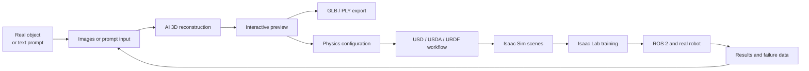

This workflow supports the full engineering loop:

**Real object or description -> 3D reconstruction -> robot-ready asset -> simulation -> policy training -> real robot validation -> data feedback.**

## Three Ways to Create Assets

### 1. Multi-view image to 3D

Take 2 to 4 photos of the same object from different angles. Multi-view input provides more geometric evidence, reduces occlusion-related ambiguity, and is well suited to digital-twin and robot-simulation workflows.

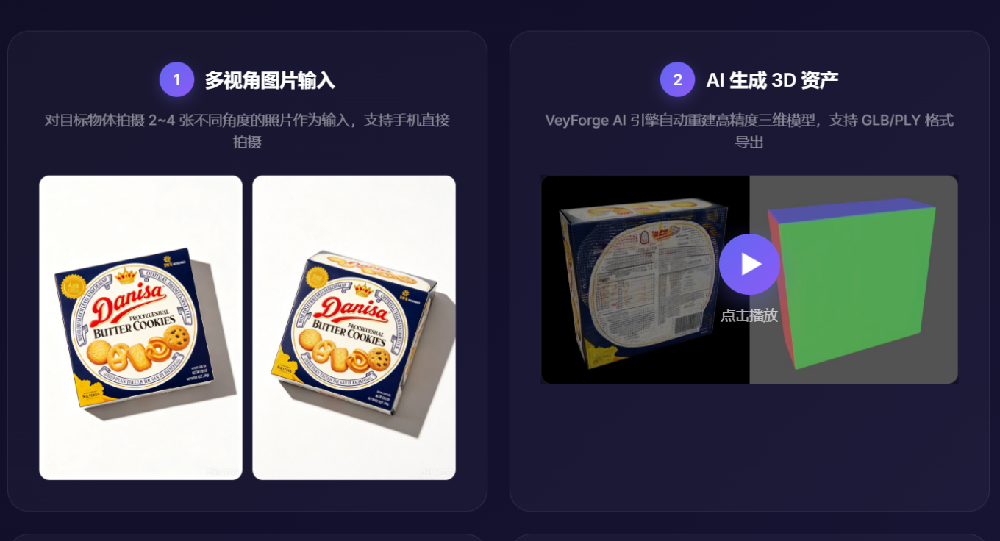

### 2. Single image to 3D

Bring product photos, historical images, catalog images, or on-site captures into the digital world. Single-image generation is useful for fast concept validation, asset screening, and early scene prototyping.

### 3. Text to 3D

Use a natural-language description such as `a red apple with a smooth surface` to create a visual prototype. Text-generated assets can be used for concept exploration, scene prototyping, and downstream selection before simulation.

## From Input to Export

The production pipeline is designed around fast inspection and practical downstream formats:

1. **Input** - Upload multi-view images, a single image, or a text description.
2. **AI generation** - Process the input and reconstruct geometry, appearance, and texture.
3. **Quality inspection** - Review Gaussian rendering, normal rendering, and an interactive 3D view.
4. **Asset export** - Export visual assets and simulation-oriented formats.
5. **Simulation and training** - Bring the result into robot scenes, task validation, and training.

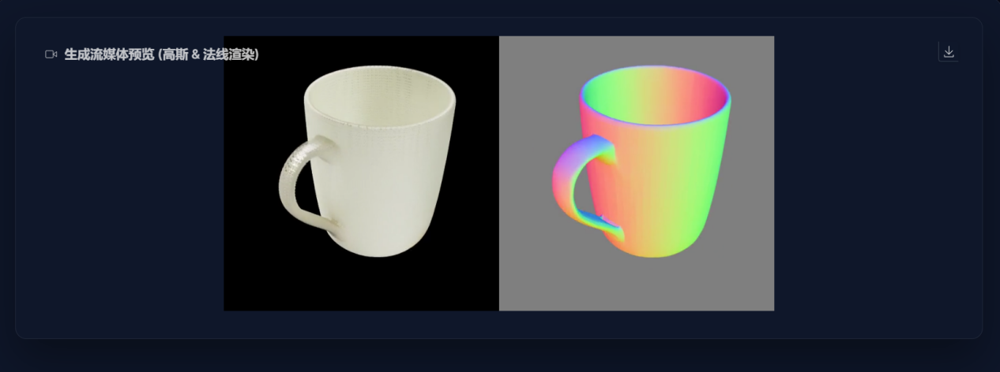

The preview stage helps teams identify geometry, texture, orientation, and viewpoint issues before an asset is added to a larger scene or dataset.

## Physics-Ready Assets

VeyForge extends visual asset generation into physical asset preparation. A generated mesh can be used to estimate or configure:

- Mass and density
- Volume and center of mass
- Inertia tensor
- Visual and collision meshes
- Static and dynamic friction
- Restitution coefficient
- Collision-body representation

Supported collision representations can include:

```text
none
convexHull
convexDecomposition
boundingCube
boundingSphere
```

The resulting parameters can be written into USDA assets and inspected in a physics visualization workflow. This is important for grasping, stacking, contact, sliding, loading, and manipulation tasks where appearance alone is not enough.

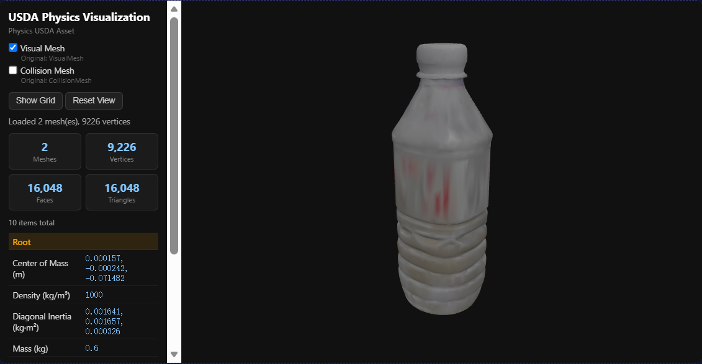

## Real-to-Sim and Sim-to-Real

VeyForge treats 3D assets as the front end of a closed-loop robotics system.

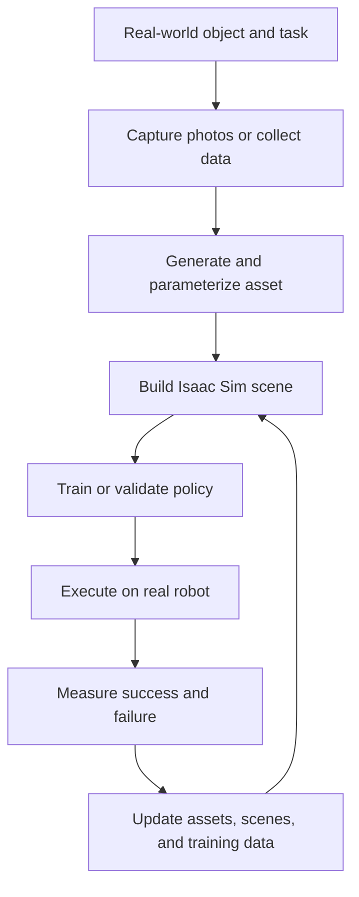

### Real to Sim

1. Capture a real object from multiple views.
2. Generate a textured 3D model.
3. Add collision, mass, friction, and inertia information.
4. Convert or export the asset for Isaac Sim.
5. Use the asset as an object that a robot can perceive and manipulate.

### Simulation

In simulation, teams can vary:

- Object shape, size, and material
- Object pose and placement
- Lighting and background
- Collision and friction parameters
- Task difficulty and scene composition

This enables large numbers of grasping, stacking, navigation, obstacle-avoidance, and loading/unloading experiments without consuming real robot time.

### Domain randomization

Multiple categories, textures, shapes, and scene configurations help training systems encounter more variation before deployment. This can reduce overfitting to one idealized object or one fixed environment.

### Sim to Real

Validated policies, trajectories, perception results, and task logic can be transferred to a real robot for controlled testing. Real execution results can then become new simulation conditions and training samples.

## Isaac Sim and Web-Based Task Simulation

The VeyForge workflow is designed to continue after asset generation. In the accompanying IsaacSim-qt style platform, users can upload GLB or USD assets, select a scene, configure task parameters, launch simulation, and observe the run from a browser-oriented interface.

The simulation workflow can expose:

- Asset upload and conversion
- Scene selection
- Scale and mass configuration
- Pick and place offsets
- Conveyor speed
- Simulation status and task control
- Extensible scene plugins and task parameters

### Conveyor loading and unloading

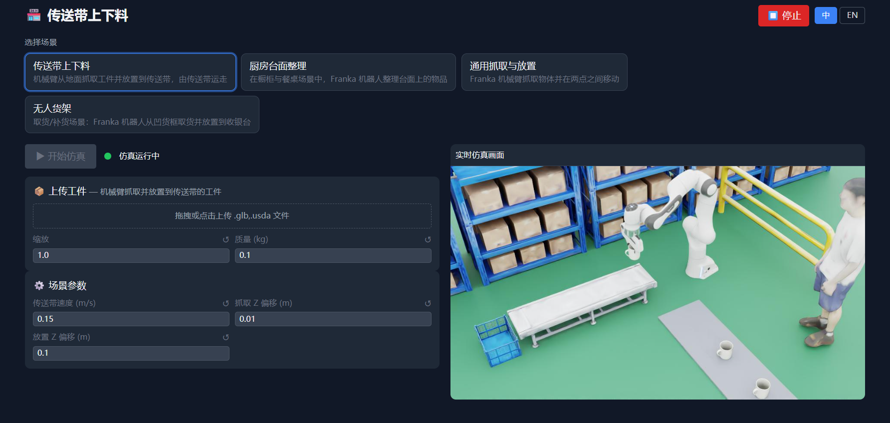

Use generated assets to test robotic loading, unloading, grasping, placement, and conveyor workflows.

### Kitchen organization

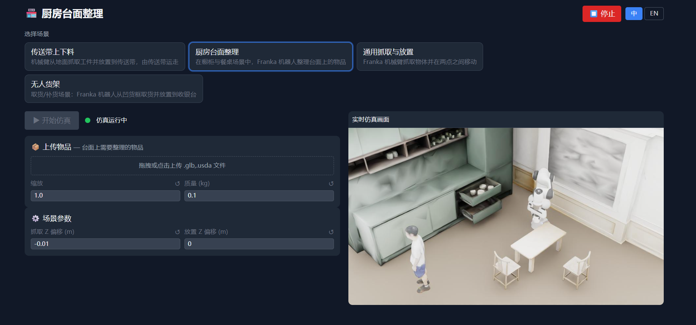

Configure objects and task parameters for tabletop and kitchen-style manipulation scenarios.

### General pick and place

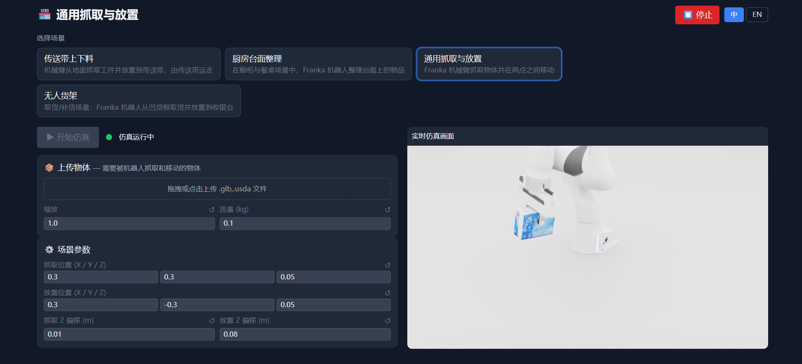

Validate the complete flow from target selection and approach to grasp, transport, placement, and release.

### Autonomous shelf workflows

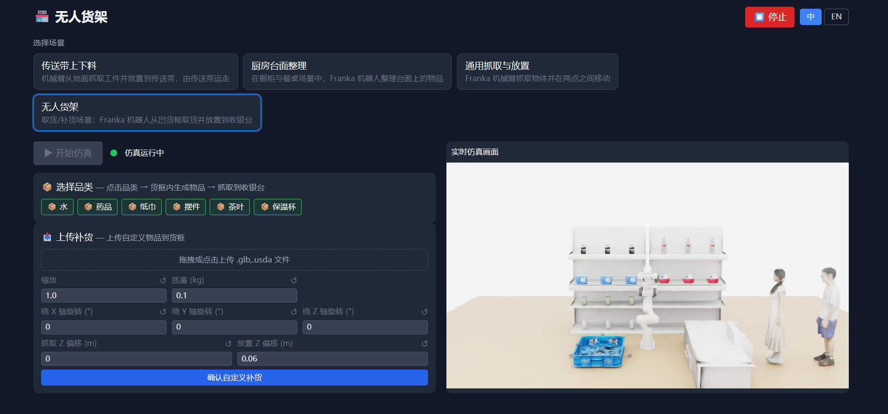

Reuse the same asset in a business-oriented flow such as shelf picking, replenishment, and placement at a checkout or staging area.

## ROS 2 and Real Robot Synchronization

For real robot integration, a shared joint-state interface can connect the virtual and physical sides of the system.

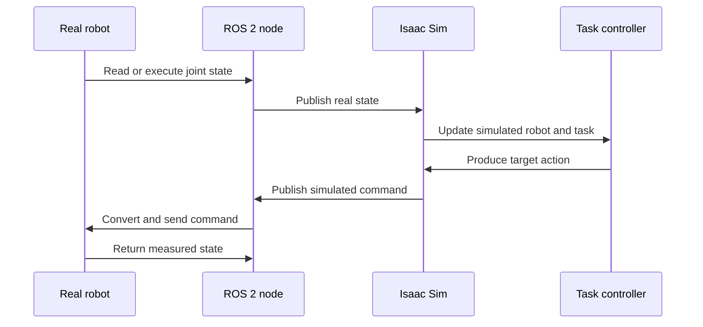

In a representative myCobot Pro 450 and myGripper F100 integration:

- `sensor_msgs/JointState` acts as the shared ROS 2 interface.
- The real side can use the `pymycobot` SDK.
- Isaac Sim can publish and subscribe through Action Graph nodes.
- Joint names are kept consistent across both sides.
- Angle units and gripper opening values are converted at the interface.
- A pick-and-place controller can run through home, pre-grasp, grasp, close, lift, pre-place, place, release, and return states.
- Measured real joint angles can be written back to the simulation side for comparison.

This makes it possible to validate actions in simulation, execute them on hardware, and inspect the difference between planned and measured behavior.

## Isaac Lab and Task-Scale Training

For larger experiments, generated assets can be composed into Isaac Lab or similar GPU-accelerated training environments. An Arena-style architecture can keep three concerns separate:

| Layer | Responsibility |
| --- | --- |
| Scene | Layout, objects, asset parameters, and environment conditions |
| Embodiment | Robot body, joints, end effectors, and sensors |
| Task | Grasping, navigation, opening, turning, insertion, sorting, or organization goals |

The same VeyForge asset set can therefore be reused across different robots, scenes, and tasks. This helps teams move from a single demonstration to reinforcement learning, imitation learning, motion planning, and multi-task training.

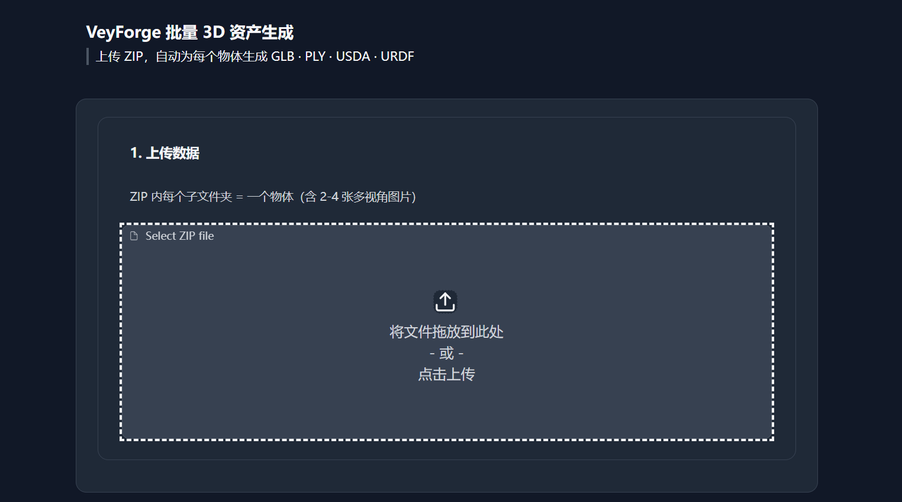

Batch input can organize multiple objects and multi-view images as a ZIP package and produce outputs such as GLB, PLY, USDA, and URDF-oriented assets for dataset production.

## Application Areas

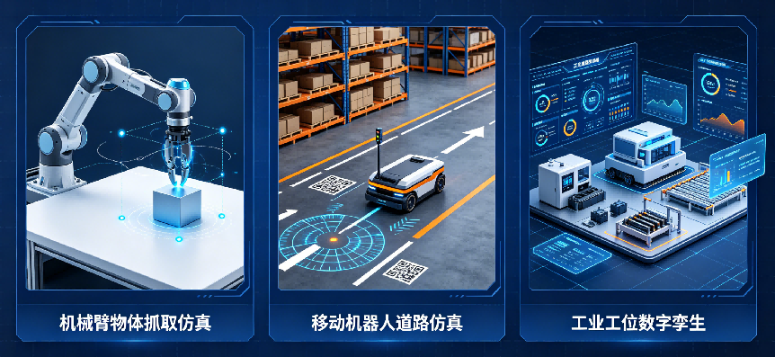

### Zero-shot grasping and dexterous manipulation

Generate diverse object shapes, materials, and sizes, then add physical parameters for grasp policy training, failure replay, and generalization testing.

### Mobile robotics and autonomous driving corner cases

Build uncommon, complex, or high-risk scene elements for simulation-based safety and perception testing.

### Industrial workcells and conveyor operations

Digitize equipment, products, conveyors, and manipulated objects before deployment. Validate loading, unloading, palletizing, stacking, and grasping logic in simulation.

### Physics-aware digital twins

Combine visual models, physical parameters, and scene semantics for facility inspection, warehouse logistics, industrial workcell replication, and vehicle simulation.

### Scalable asset and training-data production

Use batch generation, consistent parameters, automated exports, and task management to connect asset production to an existing engineering pipeline.

## Why It Matters for Teams

| Traditional workflow | VeyForge workflow |
| --- | --- |
| Multiple manual tools and handoffs | One connected asset-to-simulation pipeline |
| Hours or days for a single asset | Fast AI-assisted generation and inspection |
| Specialist modeling resources required | Images, prompts, and configurable technical controls |
| Visual mesh is often separated from physics setup | Visual, collision, and physical properties can be prepared together |
| Simulator adaptation happens late | Isaac Sim and task workflows are part of the target pipeline |
| Real robot results are difficult to feed back | Real-to-sim-to-real iteration is an explicit design goal |

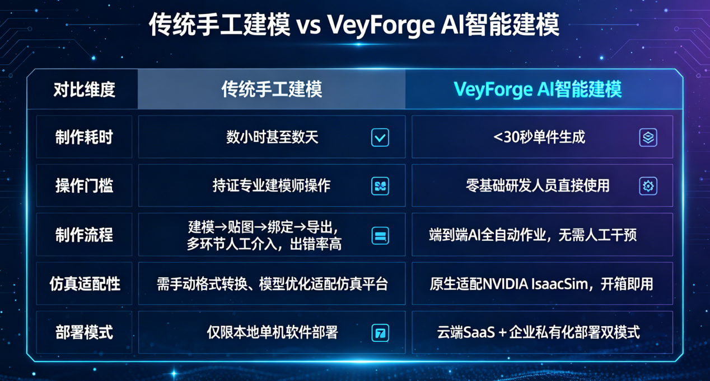

The result is a practical data flywheel:

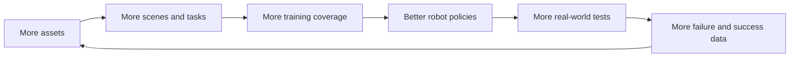

## A Typical Project Workflow

1. **Capture** - Take 2 to 4 photos of the target object, or prepare a single image or text description.
2. **Generate** - Select the input mode and start AI reconstruction.
3. **Inspect** - Review Gaussian, normal, and interactive 3D previews.
4. **Physicalize** - Configure mass, density, friction, restitution, and collision representation.
5. **Export** - Produce GLB, PLY, USD, USDA, or URDF-oriented outputs as required.
6. **Simulate** - Run grasping, navigation, stacking, loading, unloading, or corner-case tests.
7. **Train** - Use the asset in policy training, imitation learning, reinforcement learning, or motion planning.
8. **Deploy and learn** - Validate on a real robot and feed results back into the next simulation round.

## Deployment and Integration

VeyForge is intended to support different team sizes and deployment requirements:

- Web-based SaaS experimentation
- Enterprise workflows and API integration
- Private or on-premise deployment scenarios
- Batch asset generation and standardized output
- Integration with simulation, automation, and data-production systems

The product website is the primary entry point for trying the VeyForge experience:

**[veyforge.tsingtaoai.com](https://veyforge.tsingtaoai.com/)**

## Media Gallery

<table>
  <tr>
    <td></td>
    <td></td>
  </tr>
  <tr>
    <td>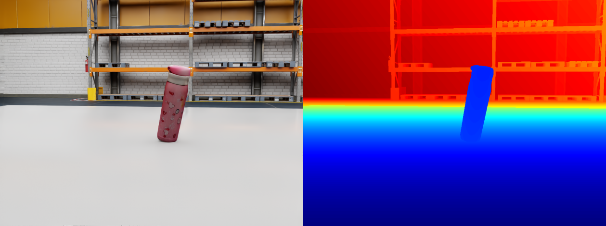</td>
    <td></td>
  </tr>
  <tr>
    <td></td>
    <td></td>
  </tr>
  <tr>
    <td></td>
    <td></td>
  </tr>
</table>

## About TsingtaoAI

VeyForge is developed by TsingtaoAI for robotics developers, simulation engineers, embodied-intelligence teams, and intelligent-manufacturing organizations.

For product access, technical collaboration, robot simulation, digital twins, batch asset generation, or private deployment, visit the [VeyForge product website](https://veyforge.tsingtaoai.com/).

